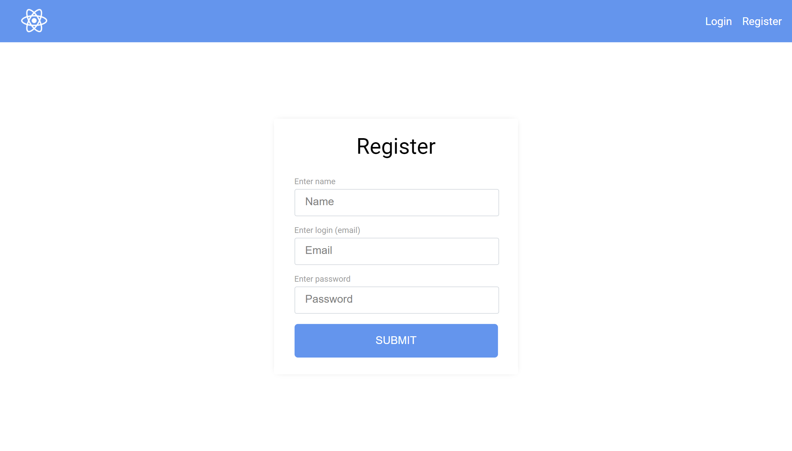
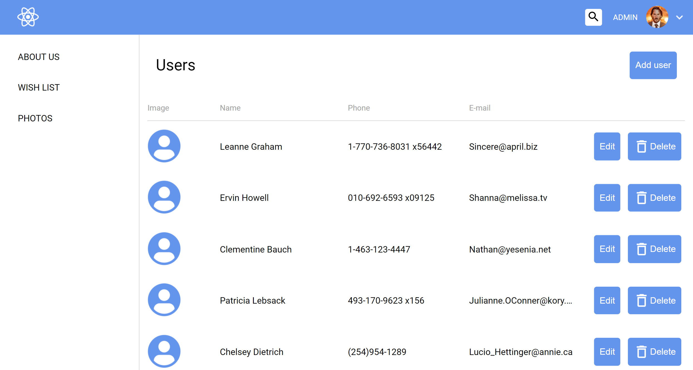
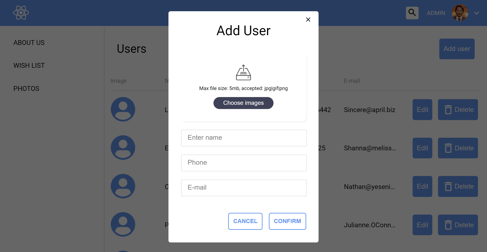

## General info

This project is a layout of a classic app based on React. It was made as a part of educational process.

## Technologies

Project is created with:

- React - version 17.0.2
- Node-sass - 5.0.0
- Classnames - version 2.3.1
- React-router - 5.2.0

## Installation

Use
`npm install`
to setup project according to data from package.json

Tnen use
`npm start`
to run the app and to view it in the browser (http://localhost:3000).

## Screenshots

